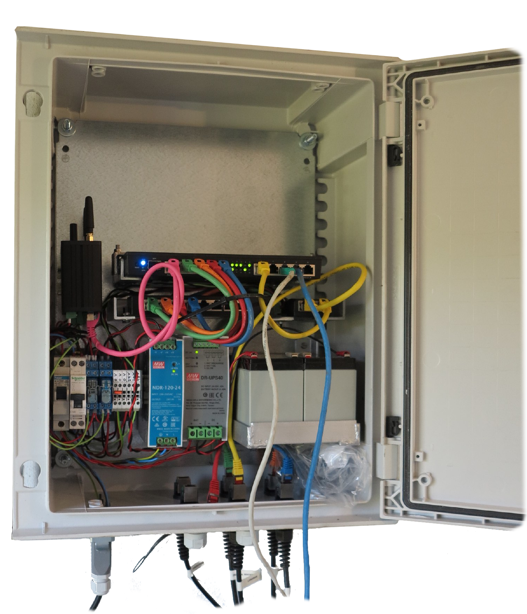

# Guifi.net Outdoor Supernode

So you want to extend the coverage of [Guifi.net](http://guifi.net) in your zone and you've decided to build and install a supernode!!! This is a guide about how to build a supernode that will withstand harsh conditions.

## Introduction

You are probably very excited with the [Guifi.net](http://guifi.net) project, as we are, but after searching, you probably haven't found a step by step how-to guide of how to build a ISP grade infrastructure. This project will put special attention in the Hardware part, while triying to not forget the software part. To get a cood coverage, you´ll probably have to install your supernode in some not-very-accesible place, like the top of a mountain, with the roter and the PSU inside a sub-otimal building. This guide is specifically about building a IP66 rated outdoor Supernode. The antenna selection and installation will be also covered.

## Project Requeriments

For our systems, we have decided to meet theese criteria. They can be modified or altered to suit your project and the parts list in consequence.

* All the Supernode components, except the antennas must be contained in a waterproof cabinet rated for outdoor usage.
* The system should have a UPS or Backup power supply system
* The cabinet should fe fitted with quick connectors and avoid hardwaired connections to the antennas, allowin changing the cabined quickly in case of failure
* The system should have backup conectivity other than Guifi.net network for management purposes, via GPRS/3G/4G or LoRa packet radio 
* The system showuld have a remote hard reboot system

## Parts

These are the parts we have chosen for building the Supernode and the cost of the porject (taxes not included):

Part                                                                    | Price         |Quantity       |Subtotal       | Order/link
------------------------------------------------------------------------|---------------|---------------|---------------|--------------------
Electrical Cabinet - Schneider NSYPLM54PG                               | ~ EUR 110.-   | 1             | ~ EUR 110.    | Contact your local Industrial Electrician Shop
Electrical Cabinet Metal Plate - Schneider NSYMPP54                     | ~ EUR 27.-    | 1             | ~ EUR 27.-    | Contact your local Industrial Electrician Shop
Electrical Cabinet Wall Mounting Kit - Schneider  NSYPFXPLM             | ~ EUR 20.-    | 1             | ~ EUR 20.-    | Contact your local Industrial Electrician Shop
Harting Connector Chassis - Han 3A-AGG-QB                               | EUR 5.70      | 1             | EUR 5.70      | www.tme.eu/details/09200030301/  
Harting Connector Aerial - Han 3A-GG-M20                                | EUR 4.40      | 1             | EUR 4.40      | www.tme.eu/details/19200031440/  
Harting Connector 4 + 1 Male - Han 4A-STI-S                             | EUR 9.90      | 1             | EUR 9.90      | www.tme.eu/details/09200042611/  
Harting Connector 4 + 1 Female - Han 4A-BU-S                            | EUR 10.74     | 1             | EUR 10.74     | www.tme.eu/details/09200042711/  
Amphenol IP67 RJ45 Connector Base                                       | EUR 4.21      | 6             | EUR 25.26     | Mouser.com 523-RCP00AMMATLM7001
Amphenol IP67 RJ45 Connector Cable Cover                                | EUR 8.54      | 6             | EUR 51.04     | Mouser.com 523-RCP5SPFFHTCU7001
Amphenol IP67 RJ45 Connector Cap                                        | EUR 3.51      | 4             | EUR 14.04     | Mouser.com 523-CAP-WACMTPC1
Fibox GPA M20 Cable Gland                                               | EUR 0.37      | 5             | EUR 1.85      | www.tme.eu/details/gpa-m20/  
Fibox M20 Nut                                                           | EUR 0.15      | 4             | EUR 0.60      | www.tme.eu/details/gpa-m20-b/  
MeanWell DR-UPS40                                                       | EUR 31.30     | 1             | EUR 31.30     | www.tme.eu/details/dr-ups40
MeanWell NDR-120-24                                                     | EUR 23.10     | 1             | EUR 23.10     | www.tme.eu/details/ndr-120-24/  
Meanwell DDR-60G-24                                                     | EUR 21.86     | 1             | EUR 21.86     | www.tme.eu/details/ddr-60g-24/  
Meanwell DDR-30G-24                                                     | EUR 17.45     | 1             | EUR 17.45     | www.tme.eu/details/ddr-30g-24/  
Yuasa NP7-12 Battery                                                    | EUR 20.60     | 2             | EUR 20.60     | www.tme.eu/details/accu-hp7-12_y/  
24 Volt DPDT Relay                                                      | EUR 3.62      | 2             | EUR 7.24      | https://www.tme.eu/es/details/40.52.9.024.000
DIN Rail adapter for Relay                                              | EUR 5.50      | 2             | EUR 11.-      | https://www.tme.eu/es/details/95.85.3sma
DPN L+N 6 Amp Narrow Circuit Breaker                                    | ~ EUR 12.-    | 2             | ~ EUR 24.-    | Contact your local Industrial Electrician Shop
DIN Rail terminal blocks                                                | ~ EUR 1.5     | 5             | ~ EUR 6.-     | Contact your local Industrial Electrician Shop
DIN Rail terminal block links                                           | ~ EUR 0.5     | 5             | ~ EUR 2.5     | Contact your local Industrial Electrician Shop
Mikrotik RB4011 Ruter		                                        	| EUR 155.59    | 1             | EUR 155.59    | https://www.landashop.com/mkt-rb4011igs-rm.html
Teltonika RUT 955 2G/3G/4G Router with DIN Rail Adaptor                 | EUR 175.08    | 1             | EUR 175.08    | https://varia-store.com/en/produkt/31202
Sinlge port Gigabit PoE Injector                                        | EUR 4.92      | 1             | EUR 4.92      | http://www.ciudadwireless.com/network_apoe03_redundancy_industrial_adapter-p-4594.html
8 port Gigabit PoE Injector                                             | EUR 25.54     | 1             | EUR 25.54     | http://www.ciudadwireless.com/network_apoe08g_passive_gigabit_injector-p-7241.html
Logilink Ethernet color cables                  						| EUR 1.47      | 10            | EUR 14.70     | https://www.tme.eu/es/details/cq3015s (Search for multiple colors)
**Total Cost**             												|               |               | **EUR 821.41**| **Excluding work force :)**

Those are the consumables:

Consumable                       | Order/link
---------------------------------|--------------------
M3x30 Screws, Nuts and Washers | Local hardware Store
Self Tapping Screws | Local hardware Store
DIN Rail with Holes | Contact your local Industrial Electrician Shop
25x25x3mm L shped steel angle | Local hardware Store
Stainless M4 Threaded Bar, M4 Nuts and washers | Local hardware Store

## Powering Considerations

We decided to supply the complete system with DC power directly. Since we wanted a battery backup system, our two options were to use a comercial AC UPS or o build a DC UPS. We decided to build our own DC UPS using off the shelf parts.

The AC input is protected by a 6 Amp circuit breaker and the battery power is also protected by a 6 Amp circuit breaker. A fuse and a switch or a circuit breaker in mandatory on the battery power both for protection and for removing the DC power (in conjunction of removing the AC power) if we want to shut down the system.

The main power bus is unregulated at 22-28 Volt DC nominal, and it is connected directly to the batteries using the MeanWell DR-UPS40 module. The DC bus is supplied by the AC-DC MeanWell NDR-120-24 switching power supply, which its V-Out have been adjusted to 27.6 to keep the batteries in float charge (13.8 Volts per 12 Volt battery). When the AC power fails the systems starts to discharge the batteries until 21-22 Volts when the DR-UPS40 module power offs the system. This DC bus supplies the Mikrotik router and the DC-DC Switchind supplies for powering the antennas.

The antennas to be used with this system have a maximum VIn of 24 Volts DC, so after regulating the 22-28 Volts to 24 Volts DC with a Meanwell DDR-60G-24, this voltage is feed to the 8 port PoE Gigabit injector. For maximum failsafe, each antenna should have its own injector and DC-DC supply, since with this setup, a single malfunctioning antenna connection can bring the system down.

A second DC-DC converter have been used, which have been wired in series with the first converter to get 48 Volt for the LoRaWAN Gateway we have installed.

The bus DC power supply to the Mikrotik have been passed from a normally closed relay, and the bus DC power to the DC-DC converters from another relay. These relays are connected to the digital outputs of the Teltonika 3G/4G router, which allows a remote hard reboot of all the devices (except the Teltonika router itself :P ).

## Wiring Considerations

Planning the cabinet as a modular and upgradeable system, quick connectors are almost mandatory. Anyway, it have been decided that all the external connectors must be quick connectors. One notable exception to this rule could be a Earthing bronze screw, for attaching a conductor strip to a good connection to a Earth bus-bar.

For the power input a Harting series connector has been used. A 5 pin (4 and Earth) connector have been choosed thinking in a possible future DC input.

The devices attached to this cabinet will be connected using Cat 5e RJ45 connectors. To accomplish this, Amphenol brand connectors have been choosed. 

If hardwired connections are going to be made, for example a locally attached device with a quick connector on the other side, M20 Cable glands could be another solution.

## Ethernet Cabling considerations

The placement where we have installed this Supernode, have been a little bit tricky. Mainly because we had a 300 Watt FM transmiter on the same tower, and we have learned some intereseting lessons during the theployment of the Supernode.

At first we built the ethernet cables on site, using Ubiquiti Tough Cable Pro, and shielded RF45 connectors, grounded on both sides for the PowerBeam antennas and grounded only in the bottom for the Rocket radios. Since the Rocket radios have electrical connection to the mast via the mounting hardware, we decided not to connect the ground of the Rocket sides to avoid ground loops. Unfortunately, when we fired up the system, most radios were negotiating 10 Mb Ethernet and one of them at 100 Mb half-duplex. We shut down the FM transmitter and everything started working as expected at 1 Gbps. We thied to ground better the cables at the bottom, but we haven't achieved anything. 100Base-TX and 1000Base-TX use clock signal of 125 MHz, which is in the VHF band, and is affected by the commercial FM transmitter (on our case, it was transmitting at 91.8 MHz). The 10Base-T specification works at 10 MHz, so thats why the 10 Mbps link was possible.

After reading on the net, we got the conclusion that we needed a better cable, and since people was getting 1 Gbps speeds on sites with 10 and 15 kW FM radios, that we should be able to get the rig working near a 0.3 kW transmitter.

We ordered a Ubiquiti Though Cable Carrier roll and Though Connectors, we crimped them, and on the botton we soldered a 0.5mm2 cable attached directly to the ground bar of the placement. And everithing started to work as expected. Anyway, we made some mistakes also in this process, like crimping the cables on site, which proved to be a bad idea, since 2 of the 4 cables we made didn't achived Gigabit speeds. The next day we went with cables made at home with patiente and the proved good. Anyway, all crimped cables should be tested with a cable certifier.

Learned lessons:

* Though Cable Pro is enough for instalations unless there is a high power RF transmitter near, but if there is something transmitting in the VHF band, something better has to be used. On our case the Ubiquiti Though Cable Carrier solved the problem.
* RJ45 connector should be good quality ones.
* If there isn't some reason preventing it, cables should be pre-made at home or workshorp instead of crimping on site. This saves a lot of time on site.
* Cables should be tested and certified with a cable certifier. Since you don't have money to buy a over 2000€ device to test a couple of cables, the solution is to crimp the cables you need at your home or workshop (1.5 times more cables that you'll need, to have some spares), and find some electrical shop who will test your cables.
* Cables should be grounded to a ground bar on the bottom, to protect from RF signals and to allow a good lightning and ESD protection. Ground loops have to be avoided, for antennas that have the radio electrically isolated from the mast this is straightforward, but with radios that are not (like Rocket radios, where the RJ45 connector has a Earth path via SMA-Antenna-Antenna mount) RJ connector at the top shouldn't have the earth connected to the cable, and the shield of the RJ45 connected to a wire which will go to the mast ground, to get a good eatrh connection for the radio (since the DC connection via SMA-Antenna-Antenna steel isn't a good enough conductor at ESD discharge frecuencyies).

